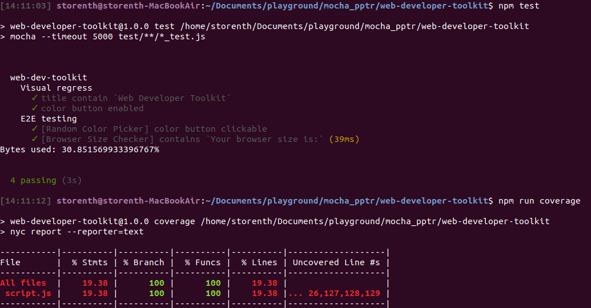

# Web Developer Toolkit

Collection of handy tools for daily work of front end developer.
I forked this project for demonstrate how JS application can be instrumented and tested with coverage in mind. Automated regression testing based on pure **[Puppeteer](https://developers.google.com/web/tools/puppeteer/)** and **[Mocha](https://mochajs.org/)**.

## Usage

- This browser-based application will include such useful tools as dynamic browser size checker, random colour picker, px/em converter, and more. Explore `./public` or just open **[./public/index.html](./public/index.html)**
- To learn more about testing this application look at `./test`. To run Automation tests read `Feature testing` bellow

## Work in progress

Needs to be done:

>JavaScript:

- the logic for px to em converter : in the first window, the user will be entering base font in px; in the second or third the user will be entering a number to convert, either in px or em, and by clicking the button the conversion will appear in the last window.
 Example : 
           Base size : 16px, PX size: 32px, EM size: 2em;
           Base size : 12px, PX size: 18px, EM size: 1.5em;
           Base size : 20px, PX size: 20px, EM size: 1em;

>CSS:

- design the page layout
- make it responsive by adding multiple stylesheets for different media queries 

>Code-coverage:

- Open Issue: https://github.com/istanbuljs/puppeteer-to-istanbul/issues/22
- More then 80% based on best practice, but now 19.38%:



## Feature testing
0. Install all devDependencies Automation need:
```
npm install
``` 
1. Run loopback server with command, which expose `127.0.0.1:8080`
```
npm run server
```
2. Now you can call Mocha with the following command:
```
npm test
```
3. Finally collect coverage:
```
npm run coverage
```
## Contributing
Any questions and/or suggestions please send me directly. Related **_Pull requests_** are welcome, but cover your changes with `Feature testing` first. For other requests, please open an issue first to discuss what you would like to change.

## Useful links
* About Puppeteer coverage: https://pptr.dev/#?product=Puppeteer&version=v1.17.0&show=api-class-coverage
* A command-line http server: https://www.npmjs.com/package/http-server
* JS test framework: https://mochajs.org/#hooks
* CSS best practice: https://www.freecodecamp.org/news/the-100-correct-way-to-do-css-breakpoints-88d6a5ba1862/#.ioazjk440
